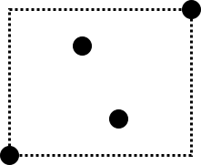
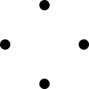

The errata on the website for Wasserman's All of Statistics (https://www.stat.cmu.edu/~larry/all-of-statistics/) was last updated on April 3, 2013.

Here are some additional typos missing from the published errata.

P. 118, Exercise 7(b): "Show that $P(\hat{\theta} = \hat{\theta}) = 0$" should be "Show that $P(\hat{\theta} = \theta) = 0$".

P. 318, Equation (20.29): $n$ in the denominator is unnecessary.

P. 339: the expression for $|\hat{r}(x) - r_J(x)|$ has a square misplaced and the last inequality should be an equality instead:

``` math
\begin{aligned}
|\hat{r}(x) - r_J(x)| &\leq \sum_{j=1}^J |\phi_j(x)| |\hat{\beta}_j - \beta_j| \\
&\leq \sqrt{\sum_{j=1}^J \phi_j^2(x)} \sqrt{\sum_{j=1}^J (\hat{\beta}_j - \beta_j)^2} \\
&= a(x) \sqrt{L}
\end{aligned}
```

P. 348, Exercise 11: $\sqrt{n}$ in the expression for $\hat{\sigma}$ is unnecessary.

P. 360, Expression (22.29) is missing the multiplier $n_s$:

``` math
I(t) = \sum_{s=1}^2 \gamma_s n_s,
```

where $n_s = \sum_{i=1}^n I(X_i \in A_s)$.

P. 361, Figure 22.3: the value on the y axis should be 100.

P. 362, Figure 22.4 and P. 365, Figure 22.7 were plotted using the deviance as the split criterion as opposed to Gini which is described in Section 22.7.

P. 367, Definition 22.20 should say "Otherwise, define $VC(\mathcal{A})$ to be the largest $k$ for which $s(\mathcal{A}, k) = 2^k$".

P. 368, Example 22.25: the assertion "Any 4 point set can be shattered" is incorrect. For example, the following set cannot be shattered, since every rectangle containing the corner points will have to contain the inner points as well, so the corner points cannot be picked out.



The VC dimension is still 4 in this case, since there are sets of 4 points that can be shattered, for example:



P. 370: the equation for finding $\hat{a}_0$ should be

``` math
Y_i (X_i^T \hat{a} + \hat{a}_0) = 1.
```